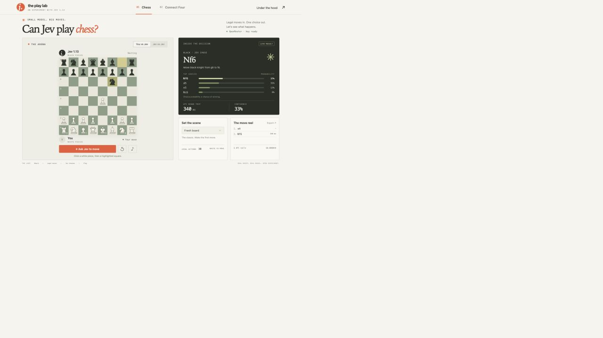
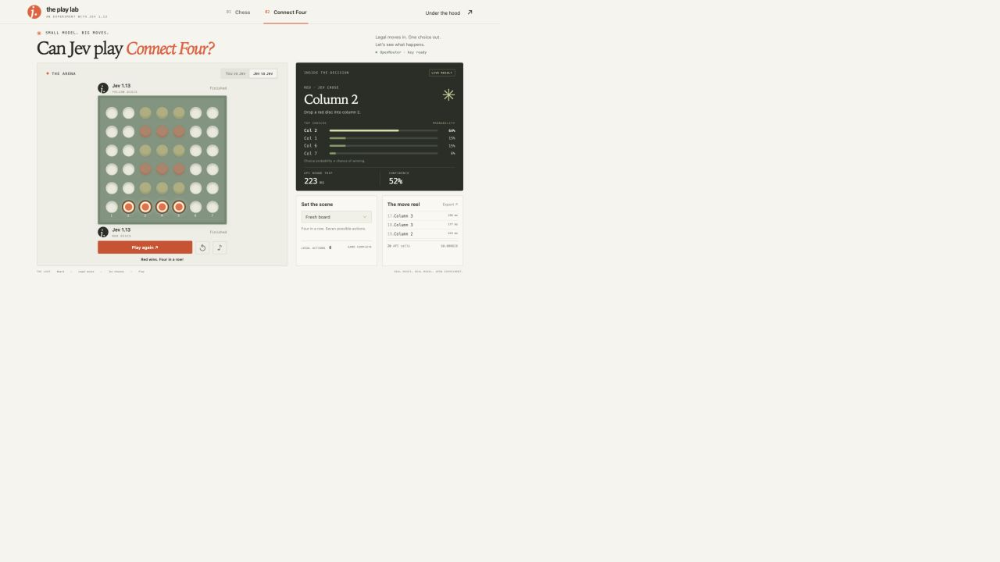

<div align="center">

# Jev plays games.

**Test your game playing skills against the speed demon...Jev!**

<table>
  <tr>
    <td align="center"><a href="docs/screenshots/chess.jpg"></a><br><b>01 · Chess</b><br>You bring the opening. Jev brings a reply.</td>
    <td align="center"><a href="docs/screenshots/connect-four.jpg"></a><br><b>02 · Connect Four</b><br>Seven columns. Room for questionable decisions.</td>
  </tr>
</table>

Play against [Jev](https://openrouter.ai/typesafe/jev-1.13), or let it play itself.<br>
See Jev's "thoughts" on what move to play. No promises of grandmaster play.

[Get started](#get-started) · [How to play](#pick-your-seat) · [How it works](#inside-the-play-lab)

</div>

## Get started

You need **Node.js 22.9+** and an [OpenRouter API key](https://openrouter.ai/settings/keys) with credits.

```sh
git clone https://github.com/vtrivedy/jev-plays-games.git
cd jev-plays-games
npm ci
```

Create a `.env` file in the project folder:

```dotenv
OPENROUTER_API_KEY=your_openrouter_key
```

```sh
npm start
```

Open **[localhost:4317](http://localhost:4317)**. If the key is already set in your shell, skip the `.env` step. The key stays on the server; `.env` is ignored by Git. Each Jev turn uses a paid API call.

## Pick your seat

| Mode | Make your move |
| :--- | :--- |
| **You vs Jev** | You are White in chess and Red in Connect Four. Click a piece, then a marked square; or click a column to drop a disc. Jev replies. |
| **Jev vs Jev** | Select the mode, then press **Watch Jev play**. Jev takes both sides. Pause at any time. |

Try **Find the finish** for a quick puzzle. **Ask Jev to move** lets Jev take the current turn, including yours. A win leaves the board visible; Connect Four marks the four winning discs.

Turn on move sounds with **♪**, start over with **↺**, or **Export** the moves and API results as JSON. Auto-play pauses after 80 turns; press play to continue.

## Inside the play lab

**Board → legal moves → Jev chooses → check → play.**

1. **Describe the board.** Chess sends piece locations, the turn, recent moves, and FEN (a standard position format). Connect Four sends six rows of `Red`, `Yellow`, and `empty` cells.
2. **Offer every legal move** in one [Choice question](https://docs.typesafe.ai/primitives/choice): move IDs such as `e2e4` for chess, or available columns `1`–`7` for Connect Four.
3. **Check and play the reply.** Jev returns a move ID, option probabilities, and confidence. The app validates the move and shows its scores, time, and cost.

Jev reads text. It does not see a screenshot. The app supplies legal moves without engine scores or winning-move hints. **Choice probabilities are not win odds.**

Plain JavaScript + a Node server + [chess.js](https://github.com/jhlywa/chess.js). No build step. The server calls OpenRouter’s native `/api/alpha/decisions` endpoint.
